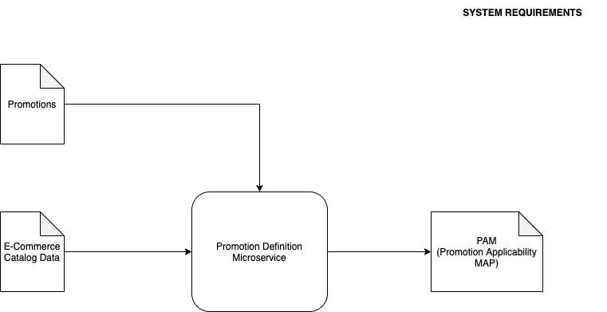

# **Software Architecture**

---

# **Agenda**

---

<!-- _class: lead -->

# **Promotion Definition**

---

# **Domain Specifications**
+ System should allow business users to create/modify promotions
+ Promotions should be created on the e-commerce data provided from catalog service
+ Downstream systems should be able to consume data in a simple flat structure called PAM (Promotion Applicability Map)

*PAM:- promotionId : offeringId*

---

<!-- _class: lead -->

---

# **System Context View**
+ Level 1 in C4 Modelling
+ Describes key users of the system

*view image*

---

# **System Container View**
+ Level 2 in C4 Modelling
+ Describes the different containers and protocols used for communication

*view image*

---

# **System Component View**
+ Level 3 in C4 Modelling
+ Low-Level details of the system

*view image*

---

# **Microkernel Architecture**
+ Monolithic architecture
+ Plugin Model
+ Communication using REST & Request-Response method (sync)
+ *Anti-pattern:* Intercommunication between plugins 

---

<!-- _class: lead -->

# **Promotion Definition: Version 2**

---

# **Event Driven Architecture**
+ Used for distributed systems
+ Broker Topology
  + High performance
  + No control over message flow
+ Mediator Topology
  + Low performance
  + Better control over message flow

*view image*

--- 

<!-- _class: lead -->

# **Promotion Definition: Version 3**

---

# **Microservices Architecture**
+ Used for distributed systems
+ Important to choose a proper bounded context
+ *Anti-pattern:* Lots of intercommunication between services (Big Ball of Mud)
+ *Anti-pattern:* Using transactions across services

*view image*

--- 

# **References**
+ [Software Architecture Fundamentals, Second Edition](https://learning.oreilly.com/videos/software-architecture-fundamentals/9781491998991)

+ [Fundamentals of Software Architecture
by Mark Richards, Neal Ford](https://www.thoughtworks.com/books/fundamentals-of-software-architecture)

+ [Domain-Driven Design: Tackling Complexity in the Heart of Software by Eric Evans](https://www.amazon.in/Domain-Driven-Design-Tackling-Complexity-Software/dp/0321125215)

+ [Link to the architecture diagrams described in this presentation](https://viewer.diagrams.net/?highlight=0000ff&edit=_blank&layers=1&nav=1&page-id=tcfmppqzrx8z4kP85BXP&title=pd-c4-context.drawio#R%3Cmxfile%3E%3Cdiagram%20id%3D%22Zpag0s_HKcgHc7mQ2Ff8%22%20name%3D%22System%20Requirements%22%3E7VjZctMwFP2azMBDGNlOszymiVlmGlpImbaPiqXYamTJyMrWr0eyJe%2BllCEwQJ8s3XO1nXvvseyeN4sP7wRMogVHmPZcgA49b95zXccZD9VDW465ZTQCuSEUBBmn0rAkD9gYrduWIJzWHCXnVJKkbgw4YziQNRsUgu%2FrbmtO66smMMQtwzKAtG29IUhGuXV8Bkr7e0zCyK7sAIPE0DobQxpBxPcVk%2Bf3vJngXOat%2BDDDVJNX8PIQ38ROmt746B6%2FveTo6pj088nePmdIcQSBmfzpqR%2FieDlyPoGHrxfL22CCNsPFRd9xzdnk0RKGkeLPdLmQEQ85g9QvreeCbxnCelqgeqXPBeeJMjrKeI%2BlPJpkgFvJlSmSMTVovqZeqBGjJw5o%2FFK%2BFQH%2BzqlMwCQUIZbfO71ThFHlP%2BYxluKoBgpMoSS7%2Bu6gScSw8CvJVg3D9zO4N7vcQbo1K10JHnNJOFPmOV4TRkxnQQLBUyx2RJ27GbAyHJrbfUQkXiYwI2ivarqL%2Bh0WEh9%2Bgvw2V2YWzzPHMTLh2frfl0XnWOmIqgVnK%2FGX8zv%2BE6mtOBTHWzM%2B69zpzpsz250fquD8aHqnLonRD5YE6I7y76mIUasieu6Qqu2eq%2FmhfklEUKRm%2F8OvW62851u51qG2XdUKzTMbmSaQ1bLAOgacctHzpvp04eqVOrjaNLCP19kU6nXDZH8NY0KPuWuE6Q5LEsAKnmbJoFHHTQ5VIF9UI4yLGNIKtjc1oMEByFMAUJVbWPTVngPCwvZIVbSyDykJWY4FKjmwqGBEZS8zswK7lwyRArJ0reayszKco3suUH3FYuAKBpswK4l%2Bgy13MM6JcgcT0ziznCGSJhQavgijxK60phzKxvLNsPn9GY9jrJPZBTMoIeWhVkOo459HVKVWHlQb6EaVq%2Fd0opuMS%2Fy0IJZnvNzKfK%2BZHUGxudSsyKxE3wBdwYb6eYX308jppKGm3llLTcddYgpOJaZWzv%2Bti8Lkb1DFyaOq%2BAxtK%2BWtVDgXPCJyaiIYJxnoeQMdkkL1mkh9koYS1rGWGNbgph66T0uidXlEFWtwUxhrYJc2WoduebToEwoJKiIJKjpph3dJZcFKQy1bUlncFtP%2FWBmL6%2BOfU0bnpT5f6rOrPqcLmwgrYY2vqt940yShKmgrQnUtqc%2B86dXr9pD%2FqbqHzc%2FIjouPMzhVfR9WbBPd8enu%2FGIMRgHae2TS8Zm%2BvFte%2Byq24LP%2F6cuHz%2F7C%2F3i9bIVDZ26d8lQKvsGzPA%2Fn5gq8JpQ2TC22Nc8qT%2BjUADFBiD4W4%2FqlS9euvaQ5J4vaoB61UVuTi%2F%2BB1aB5z4%2BZ6pZ%2F3DKs8t%2FS878B%3C%2Fdiagram%3E%3Cdiagram%20id%3D%22KKYjf8j0FIZWsQQJv1xd%22%20name%3D%22System%20Context%20View%22%3E1VjbcpswEP0az7QPyXDxrY81di5t03rGbpM8KiCDGsEyQo7tfn1XIG4GZ9ypL0leIi3LIp2ze1Zyx3bC9bUgcXAHHuUdy%2FDWHXvcsSzTHPbxn7JsMstgYGQGXzBPO5WGGftDtTF3WzKPJjVHCcAli%2BtGF6KIurJmI0LAqu62AF7%2Fakx82jDMXMKb1nvmySCzDntGab%2BhzA%2FyL5uGfhKS3FkbkoB4sKqY7EnHdgSAzEbh2qFcgZfjkr13teNpsTBBI7nPC08%2Fv4TX8cbh%2Fasv949fmWTMvfik1yY3%2BYaph%2FvXUxAyAB8iwieldSRgGXlURTVwVvp8A4jRaKLxN5Vyo8kkSwloCmTI9VNcsNg8VCePKthlL5%2BO1zp4NtvoWbZWtcCdEGhTAkvh0lf2nacSET6Vr%2FgNC6IwwymEFNeD7wnKiWQv9XUQnWp%2B4VeygQNNyD%2BQo%2BO%2BEL7UX5oKCEEyiNA8pgsWMT25Y66AhIoXhtveprQkTAG%2BCpiks5ik%2BKywauvk6G9SIen6dZibsOgXbFunvK55Oy%2FmVVlBZq4DQbV68rI6OJT2OfL8gPlq7ZmvO4g5Tb5ajXwdLRMW0SRB60%2FMzgYJFbBUxjHU3W%2FkifIpJFlm2%2BMnkBJCdCCc%2BcrgIngYyh5x5Tki7rOfMuUAB5GGtRfpXyXoZ%2F2uVMyNEinguZBzq7BUIhjG0LhStC8Y522RCzVXTh5JgiJR8EmstheufdUSLxkkg0uG%2FSm5XCbpwg9QYuZWiRXlVCkxu6XC7GMVWLfBvSsokdi6MRp4bMHU0IhzAUsauYBgyHr91FmJIKJbhGhTIzO2aQ%2BZ56Ul3aZ99TI%2FBDfDLW76e8qfdSxyhg1yHBDYJwyHSMLBx9HsEL2jQcQh0NzqJb1eE8xuC5j9Y4GZL6iCptJkFPoLF8KQKiHH8y4iu0eK75%2B6gibsD3lKQ6lEjYFFMt1bb9TpjVUsbEBJ1osO1Mi3M9luy%2BQ2mTlaJhcN800cWK1Tnlj3PbKe9QhgNs%2Bst9HFTGZyUz2%2BTiIfjwY4%2BDD9Mfv49nRnYNRz3%2FrUkvttwjPoHQvb%2Fg7hmX6%2By76H91vG6T6t9W3rTn8Le9uwmtgbp9Qdc%2FAq9uqYq7rozXw%2Bfffo9wZ19LvdFvRPq%2Fpnub7tUv3BCVXfeh8Xv%2BbNb3LhlIehNt1%2F63rfNc6t91bzTjV7nM0nSnCcH9%2Fnk4c5jn7dTu73kJxz3KUWEMm8Rs0DUNTv1ilqufMW14X%2FvPTitPxlNn1W%2BX3bnvwF%3C%2Fdiagram%3E%3Cdiagram%20id%3D%22rbJYjtm9TBNYpmV8c1C5%22%20name%3D%22System%20Container%20View%22%3E7VxZd5s6EP41Pqf3wRx28KPXLE0Tt063%2B9KDQcZqATkgN3Z%2B%2FZXYDEheUgfj9MYvhkEIMcs3mtGIltL3VxehtZh%2FQA7wWrLorFrKoCXLsqjo5I9S1gnFMMSE4IbQSUjShjCBTyAlZs2W0AFRqSFGyMNwUSbaKAiAjUs0KwzRY7nZDHnlpy4sFzCEiW15LPUrdPA8oZqauKFfAujOsydLYnrFt7LGKSGaWw56LJCUYUvphwjh5Mhf9YFHmZfz5eZiPbzuBnd3%2F4rX1qALryzYTjobPeeW%2FBVCEOA%2F7vpz5%2B7m4sclBjZ4eFQ%2Fyg%2FX38S23En6%2Fm15y5Rh6cvidcbBEC0DB9BexJbSe5xDDCYLy6ZXH4nOENoc%2Bx45k8ih5UE3IMc2GSoICcGxonl8M706g57XRx4iFwYBCkgXvfT5IMRgVZHYnteVchkQ5QXIBzhck%2FvSXtRUaqna5vr4uFECPZPsvKAAeqYZVqp4bt71hrnkIOUvn9fQ73SW728mD7%2Bf7sXB4Onmy4d2W1IYXk%2B%2BT%2B6HHwitf3d73726HX4ix1%2Buhl8ZIRDu4DKnIxyiX6DCTQ6DGYlQXkNiIN30gg8dhz6GK9qy8GcowJN0UFJdktMrojNYyeXSLEpOqU1wOiMO4BCQSU9RiOfIRYHlDTfUCuM2bW4QWqQS%2FAkwXqeIaS0xKss3eSZ90B8wlwwWLUMb7HorNUVjK3QB3tVQ44srBJ6F4e%2Fy8I5hPhehJKMJ5pdQCwROl3qijU0RygjS94j7b0JSfF6dSlI7h1nAt3GIfIQhCiJC%2F3xFvSpylkRE232MtN%2FH1AU8cqfiMzQWeSRFY5GnNpcha00oP%2BFhuP5G7xe07PR72l18MliVztbFszEIIXl56mkS4gripC9DS0%2B%2FZ88hx5uu6EnWU%2B0WpR2IfbLaJPaZr0n6TciMyzXlSJHFtxLAt9aFBgsEAxwVeh5TwgY7FM0sYYdmVmbjlfayoe5qTw6SEWyUJ3%2BVP9enzmvSJy6anI2SHetpT6Jk1fa6qtavZJJ0VlomkNn7a1a0Yx3QSRRNVZXTo1k232xM0SSjomraq9Y06VjHedRch5N4Ook089DO9qwognYpustmqQVgOdv5K5%2BrWyKe84IPyawXPnbykBeuEvIAzGAA05MP0A5RBMLfkIhFFt91x1fRP4y%2BnmUQq8qNB7ENWXaO0yKJ4o7H6Q0OmHIRCTa4wMcCenJyzDdZfOA37JwI83cOs7T6oHs4zTS36KpQkssm5IclXWghrFPE%2BFck6W76H98bLaygpG9ZQ9ppO4o1pksaSPJiRf7iO8X42mNqD%2FSqynvEwMLWzCP%2BIn0Uee3kaeUREHLyAhm5ov8FPS1m7Mm7aZKpjpRt6f1q6h5TY%2Bh51hR4YxQlaMXJ9N9UGkwRxsjnrQ2Ql7Fh4N7HRtbWs5R%2FYmSSxCwBJOeF8XfiH%2B1pbi1oG3%2Fl0oVFwbUXsjAHqyubDqG3CJMD4nbR0vnh5HytBxW1CihKGk1HVXFR1zmwaApaXcCoNAuMzwPF2jGrcyhmNZvlZldMx8tptJwysuRYgDCFbqzrQqL2i%2BTOknwqgKAqpjEaEDrpxIGgZGyqbirD7j6w2Gr9fDRhMKEum5TM6kzFYCxSlViLzCoSXj4EeTPHaub7kLCxSWuUOWtOb9b4R%2FUSlbhBk0WB9ZAntUeRke1V0J5gFNIYrBirDQMXBnFgNr6bHBmXnYzhhq6VGG4YMofhksqpdDBeYEbCR8CGZyRZaHVsqHb2WZ3tSHquKWFTKaurrncq6lZHipdBgGG7j3wfhPY2DHiVtq%2BJUsOWz9am7Y2mp5b9y435207DdBo2h%2B70nayaNK6WyVBE4lg2x5r4DxtT3wKk%2FtwaUG9x49CP6z6L0uM70L1%2BN46ee%2Fm7FBz6LP6RJvHDutEiqU%2BlUGBlJzO4otrVS8czmGNMC1u7VBryyHYCVYAk0J1BooWhYJMnyiM65SB%2FlE4MbuQRuIza09AKnIiuK47opGYUUK60JdkUFoFblx5W42Jd1QSZ4%2FVNVhMz2otrIjujO%2FOc0CfgwOgtIfSyCSEf%2BChcR%2FFkb6uN1l1CLFWtg1NDXFvKaHvZQTncQRF2QzD5eMMo1V5p7wVPVh32FR3HptgbjmSOxK2nZQiE6MGLg66pFdUpPEUx8xTfbnRTDKGm5ZAdy6yvCeBo0juxxDeQqw3k6kp8V%2BrMTp755ttAs5WN%2BUkSY8r7gsymqsF3FHmfU5585zB37Szi5eR8KyAzaZ%2Fw6gfdJxYJESZ%2B3wnJgMO31FzisDhL%2BqoiKJxZulLXLD3bE1PczFQQVFXS7PalEBCfZE3jBtRs0vwDaa31WhqVIzXgKMXgArs9MMNbZVJGcrVOoVRWL%2FKal4JQTE4EL9c2r2AXpkhk6cIsetwpjcM3iT1bbrUJoBK78nZraKcUgMzmq%2F9uAVTCI4WzUe%2B0Amhkn95zks2tw8uG6p5GiOwsosYKQrZE0NDzWCzVH1OqKEbyDumNG914bua6Wl2YPafWzLXMpq4v%2BmNCoOtXNFV4yFwoStrm4XKULlSm9P%2FpdEjSOkKn%2BCtJV1c73BSmJvBiHLU2LOIsTHfpTu93yyj2COLl%2Ff2YXav8KzyDIVcTZ1yZSLz99%2FV5B7bY8Hpyd0soqWCIAQFOVe9fIRFdr%2Byp77C%2BWuJtqq9NHAoLkFvLrydZ5fVe0TTxUYRSdqAuAWpiWYAST4B6TQIcTL7cdoYfZ8rT5f17Qxxdq727pqql9k62XnDixH1vzsRpx3b4E6Rfdo2yYF096nhAFO%2FEjzghOmcx4PAM6gGLqFsC9thgsy%2FzyIwJx5lvUxyJ7Awn7zn%2FME%2FJGkVOOhaiyIjXYyNhGdU7SckSJJm9cr4%2Fo3DM9SU%2BYsJViKYre15ms9wZ2D%2BnSmfH5oam7J%2F1rv2kbq5PYgkPuTu86nmWzLTligdUpQOr5fTnmxQ53XzXKwkJN19HU4b%2FAQ%3D%3D%3C%2Fdiagram%3E%3Cdiagram%20id%3D%22PuvBCMaWYR6RUDB_UIQX%22%20name%3D%22System%20Component%20View%20-%20V1%22%3E7VtZd9o6EP41nNM%2BwPGOeWQxLfdma0jTpi85xhZGrbEcWzSQX38lL2BLMjgNJsk95QVpbMvSzDeLZuSWOlyuP0V2uDhHLvBbiuSuW%2BqopSiybBrkj1I2GcXsSinFi6Cb0XaEKXwCGTG%2FbQVdEJduxAj5GIZlooOCADi4RLOjCD2Wb5sjv%2FzW0PYAR5g6ts9Tv0EXL1KqqUs7%2BmcAvUX%2BZlnKrizt%2FOaMEC9sFz0WSKrVUocRQjhtLddD4FPu5Xx5%2BqFrT7%2FOodWT0I%2FFdIPtcdhOBxs%2F55HtEiIQ4D8eevXPmXs2wyvpfhG3h8b16O7mvt1Nh%2F5t%2B6uMX9la8SZnYIRWgQvoIFJLHTwuIAbT0Hbo1UeCGUJb4KVPejJpuna8SO6lnTn0%2FSHyUUT6AQrIEwPbh15Aug5ZCSD0QfZ%2BEGGwZgR2YLXyVgQEvAAtAY425LlslBylGWy3cHwsYCC%2FZ1GQv55L285w522H3vGWNDL2PoPVypFZzbHyEO%2BbYrWhlHmtmzyvt0pU5PVW1V7Ca%2BGEVY7X07vpjXVOaMPL86vLC%2BvihrRvJ9Y38temTbJGwycTG8wi0vJo63wyvL7817q%2BsM7IHf3r4efJjTW8%2BXptcZIjLMVl8cQ4Qr8AI4I6GkEFBIn96mcXltB16WuEeCgjZo4CPM0mJTcmbq0s7rYiELcsELd6BGm7luK3ZQ1%2Bg5PFTBlbkztzktm9orSvIrREGKKAkEdgDgOYdc6hE6EYRL8h4aIifehfTeKPe%2FRQPqyHTfFZVRkTZgj4rAn4rPSaYrTMMZrwj9ebIVqGBNxk7S9i7Ml8hcxwWlN5TssiA2Y0xegavoJEIyFtzn2w7tM4iTAIBG7WHDm%2BHcfQSQyRHWGeXGA0WEP8vdC%2Bo%2Bako2e90TqzLklnk3cCss7vxU76lNHL%2B7vnkl7pwSsQQcIpKtWEmK4OuFwoV0euhC1oFTngMHAJJzyAD1kSHicFHOiimCGjRcC3MfxdXoMIG9kbrhCkOrJVeMawal0GXukys6eKkR47UI8ZiI1pUj5wAyVQ3S77z9HLe9%2BhjW0feYk19rFN%2FieBB%2BLMKL83e2EwwaUqndBePHxXYnD7%2FdzXFC0ehUPj396sbXCco7qUhwIowgvkocD2rR2VCR1295whFGYc%2FQkw3mRbOnuFEWM2RNaGEMfQL%2FvG5vRa5%2FX66%2BbLbVfp3dw%2BrPrh4OwxXFl6lV7XVtgXGXN9b3hC2g4gzAu896gJBmNptC6vCaIYpTHPaZ7Wc1Z4Qf2QExR63O5%2Bl9u0Mkk1naT%2B10k%2Bz0kK0wGvZLJzvO4gele8Vhm0ndLUX%2F6a3q42E%2FDwaOK2f%2FHb6uuaCJ3VaZYTmPp9kyxYn0nQnmIUgdTSb62%2BFXgwSHagV5fTF25AT7dPkhjl6%2BqCwEdk7rv6yxkulLb%2BqlokP9Pqv74WCTZCb0%2BL%2BDSD1SaR0RJETpUevU%2F90XtGzXDJbIjV2uvoz6vrgVIz1jnVxmHfJAt6MFiRjQLZLRDq15hglRVegcl5GvnMngH%2FCsVpBlQdzRDGaCmCvU%2FvHNjOLy%2BRcJ6nbinqPPkJctOYSjxLdefVNYVLfrfoDtmUxhKTAS%2BOvC2uScVKhpReScL15dqjJcoORHG3Ax0UxJ1V3Ki%2BaqpeUldZkOlWBdp6jER39TaW2dykydc4tIMSFIyHFUqyslt5tp2U7X2KX2%2F2QdGIUSEjkqlIitbbtXXp4%2B75PKd7AZD2M38bmXz6wvQaB8NcZHCZFGcHAliWEXQQrDWwmbysH4dpEZkix847c7imcBpk8xktMKbV5z6VhjJ23EBLADWHxK5FHYe8URm7Ns1TjROgkX%2Bf2Li4PYvswI1p1DFWiOkcB5QrbVkxOyHdvzcDQ1M1SjBUuzwMNZOHoXYEpyGEIe%2Bfc2DQAlSL1vJz8exgREwA%2FfHIOghhOmg7TpwJxa6shGsKVvqklFx7zBZNr2qiV1wDF8aV4N2S09lXYLqAYcaG6bKpjVXO6mX1PTHgfQboXPWvvtkmi3Fg4N0kzpdsK7MyYOp8ZbnFlgXTfmH%2BveQnsLSeEyqdBVhPHDqFQRilDeK00cq9X4IlijZxsrmpVNCGS89dJhOrm0ZH55TDMHjl0M3OEfYkQvXg3TaRI%2FYiMP1yxsHqoLwP2k4eEIcqz4kyDqyxIpC5%2FbSKQCd%2B8O%2BpAZzZcaPiY08O9Hjhqd1cUKJs0tGFx9cuPg2vCIFu4qnzqHJ1BZ3pxOm9Ww7GnVRjMnpZqIxgNNXsjkeEToZzISgpqmaYqtU%2FZGgqkVQTPk0J21B7nV7xVxK9IaihaHpHpLraEWR%2Ff3d54alj9Gn%2BNFh9tj4ve057T3j1Rv3aiAAsNcB%2FfVtjvq2pZIDeLds%2BQVTXnOMS4l8U17HZgZedMNidKkgzZrLR2nvIgHTYowJ%2FmsJuHS%2BjsM94HMwoVKDiNNWT7dG8HHRs0aNu9cRgj8ywZZiGqycyj8z%2FW95KuO66KFPFKDt63mrfJIvnP9IKyO4YyDQ%2Fgvc%2BE7eKIBPUWJ1byGM%2BTj2arX59A7vv%2FPTbLk%2FrEmNg2VxgXQOr64yBNU9rYPlzFJVnaqt0mT8TXf%2BscwRIYGzPkqEouEK6zmTl%2BqCl0%2F0RNc9xFgg2uUVlHJ3cE2i%2B6EOCY3xHIDzrJdqlVGxK39wJF%2BV9nHCp8J6vE6NpZpeN%2BGtHaV1uqKaMiBCqJ3BSzy3Bizcip0LlvqrO20alKTNQ%2BlPHZjJHBtWajo3Awd4Ubss8QvWE2feopc%2FjSCMd8aiA1zjAR8B2a3jG1%2FhaqCmXyUFF8D2Y8LuV53tM0t19f5kKcfcZq2r9Bw%3D%3D%3C%2Fdiagram%3E%3Cdiagram%20id%3D%22sw_DwP_p9699IqBz4qcr%22%20name%3D%22System%20Component%20View%20V2%22%3E7RxHc%2BJM9te4avcApRyOimQQWXDZUpZACSXCr98WIBskecznMfZM7epgup9aLfVL%2FVL7BeW8QytSQnsQ6Ib7gkD64QXlXxAEgVAC%2FOSQ4wUCUyR0gViRo19hb4CpczKuwGJY6uhGfDcwCQI3ccJ7oBb4vqEldzAlioL9%2FTAzcO%2FfGiqWUQFMNcWtQpeOntgXKIVDb%2FC24Vh28WYYut7xlGLwFRDbih7sb0Co8IJyURAkl5Z34Aw3x16BF83lBAfmN5PhYtuWbVvgTt3GZTLxnzzyuoTI8JNPTx0PFWw3c11RjntsnMDUPiQbCH6ZO1Pc9Iqw62KTY4HBKEh93chngV5Qdm87iTENFS2%2FuwdMA2B24rmgB4OmrsT2eWzeMR3X5QI3iEDfD3zwBKu4juWDrgaWYgA4e32%2FESXGoUSxD5YLv9IAcK8ReEYSHcFz11kaBZ9eGfeVIfdvXADD2BVo37AAjl6BypX1rNfJ39ALGlcM%2FwNsQ1%2BM7AoyP8L%2Bs5BNUvfIxukqsl%2Fl6BbXr9L25biGK7ierqYzYQBg3GggjYbCcAbai46wBD%2BNvAnGEy74MFaNQMvKW8LiMoyfdEALNJgJ1%2B7MBG42nwgV4gGsJvcUipMo2BolKjwiFjmNHKDFmOsNz9H1%2FDW1LHHPNGbgJ9PrR8HPojiB3VO8gdRQHK6h%2BFcIFzMLWtS4Q06HPfh4skN5TEKFcN2Qw9DBTnDtBlFiB1bgK67wBi0h7m1MPwjCKwU3RpIcr9uakibBPX0BCqOjfH3%2B3FnlnSZedPnD7U3%2B%2BNrTmXxzy0nuKnHsaBeg6LjF1Jfl5Gv4BN0AHoI00oxfqf7rZqxElpH8ahxVzwiR4SqJk91%2F3ZeLMVIRYykKvCBxAj8XS8N0fOfaGThaFMRGlDlg3Qj0L0bqxP%2F%2BhYKFP1awz5IeFC1tTkSN9NTtTQj9LH2JVhAN8FdViFzghUBlgbX%2FFmK%2FzQyAS5jG0BozoG5nIp6FaOxjIwBYmmHeNF3jcFUT9RojBtKbVMG3CurgJPJN%2B0Y9gd6bdso7b8qpXqkR9IdaDfQkI3IApnKqnoHP1mPoo3qsnk9u%2BACvMwavsIe13fUNUuDkMvIq8KXtEiNL7HVZ5vWpWyu%2BPBFdmggpTXTBQ2WiM6u%2BLvsh7qW4LuQo2aA9ndPZpDEaOVOlQf3MLvvjuyVZ5bJa%2FLzDZd%2BzWZK%2F3CxBWzMA8nwrt4H%2FMj1OISW%2Bx8iqHq%2F15sgnIZv%2BWXvzzcRc3d77c%2B3Nwhn4UFFD9YzwPSIEV330jt%2BYJkFkXEToVZwE33L8s6Epjaa%2FaWd%2BnzkEE%2FdyRGI19lCdHJH4szAOV3D3nYIEv%2Fxtjhv8qOf2s4JU9dyEBth1PCPS3hOlv1OECIh4TIQI6lm4Rv9HrTIYe1AUftQsg6suH5sCOwwYYwA6jwG7lsl3g%2BYiEthXVMOVgvgS7kB5NUiSwKvjfDcfySra1jrTuAg1viCoeb5qwotJTvNrtLJIkyCV%2BCWYAYIoSIRKQczbmV%2BzJNBtPBq63Dl7td7BynNNTSeIyaajBX7cTOOniiyG4ncSC9cEK9EnxSrrOYKocEQRasmjty95OqxALbFL8wwTe0Z%2Bft2CLkGZ4tk4VPw7PioG5pM24rMgM2AAjIQH8HN%2BEjrf219Xnd%2FF6l4xMXQnLt4D1nx51f3rAfjy9QX4faYucQ8OU5iIvhcvr2dWtyQPldD54wIDFqMBt2h2VnwNooihXxQfDFdi6pf%2BzffT56uGxy0tRJq2ceho%2BSewYXRpAIUZpPp%2FPMMLomN8Ni7fFdsnp27oUoAMp4kmXpEOgqjxrKjm02zCGk82iBMrMqbjfoWvPiR4jTa956UqR3yUtzlLIyuISA3RlVMaGc145%2F5HVxJFVeJn0o%2BiytZIlXooWVCqLrT19dSjKtRrcRIA5G5Unq5%2FL955IzXN%2BDL2FYVx8yIzV%2Fg9VUuUwVCKFHkAB9PpjnEnqhhBoQLzkap5l5Ue5J9nUZuk6SZ9e93TvibHjeHNOuHFnkZ8%2Bm%2Fb2njAYRcd%2FP%2Ft7Wnb27OcsSK8V%2BxeZFUCvnnvQqoRpKp39nvJnLcEziVoARMvv8zngE45K%2FPZQOLTPTr6QY8OreeL70nn4OV6l3IW5tF0DlFOT5bzQl%2BXzqln1geykZ9l1j%2BUwx4NQ5M%2FyWAEUWawkrp6lMFIuMxgpYmezWBVT%2FfdAo5pUbtRYsBqWdXj5VKRAWwDRT1PlXNXmC%2F0vHScfcFzGzEPbMXXvfCZfhZ0Twi4pkQOJms4qqxavq7i44cqpn48aohQv6cCvqnyqepFVehV2GOOd3GJPrQNPx0aVOLwUp1tOoec%2FOz5lUwBhQoIaOceGzC3L11EDPN8M%2Bcs2NFkD%2FVaVsCAazid28LcAi0p73Myx6xyOGVvFZw5Q9jOUh6AVjwDf%2FrCXmC8cH8e1JIn4rI9manIGtIR8bges%2By6RTvrKdtVl6K%2FXnTd1XKCa5rrSmA82zt0J4I4N4ZRjOpigkCrFYvya4JhidNihFuLxdbqWbNF12fETY%2FZ7l1nRrOQNeCPbH%2FuO%2FyBYdpzgCV26mUna0Xvt4bA672lNMQnM%2BlEMuPZZtxbddsmSUk23lVmK575xGX1zKAnaS2fBOaNOAIuCxvFJE%2FhKSJ2GdpOTRQiMtfbbgWpswB3RXixWOHxqscmqbieQFyGJwMI3Dwh%2FY6lnsAYUTfs1Qz89kSpC%2FAGBwuzR%2BCqMwIwguQ0m1jasxbfldI9gLD9nF1DjrDW1JGcO6S8ACaZiNEHR9hjrXzCttY2gNa2XdJTdyy2P7%2Bl111Eugkaw0AYgx%2Bf0nsndIwew60qe%2BNgoK3pTMIwMh7F2CRb2TEXtuURS%2FhBhEh9OTBRKqON9oA6wPGqD7kRNhptaTnJP2eXKrI81Xr7NEVW6hxeh%2FxWHx17mbfbGVpPBEPm2Yade0tqGsmKIGa7bGuaMj1ZrPTDDg2n0GAwCdch7S19szsi48Rscd2WsWF5sEeqS5WZmAcV28vdrt9GKKSfe3swpIjLEbu3bfs0zhxA91O0QlUzGwPRZPPhSz5NQ0eU0bXdPnUy1VT0g7N1%2FKF7WPWNhDmgOSo0qO3YyME6TvuCERJdF9G9lOoM3O5RYbLVRh6JOkNi%2B%2FlslzpJiOjHhddKRsRkLTI%2BQUotHOmdbL4L%2FLJMxXqTkJnBcGaDb4BUeqRoGE%2BeciRFu3mf27WPeqpzZjBg%2FIVOt4gJ2PDZoXgc472JCvG82TNbcJRxgOCtbLxETdttOaeZprKTATnZwT37JAksrXAOjmT6FF5AHbElGzRJsm1oDRNz72QfmI6ALoOu6Uks1IPUHe9kmNTF5hFJ49jeaPFytou2o%2FOboaOvjzWhPWGh8ZBjlfGEJhGEb%2BffHLiqNgRLZQJmxPGWRcyBrgJPUX2Sirv7%2FajFo8mxL%2Fu%2BuhJ7SHcRouOVZqa9npwrVabDHrgVmFXl8T0myNOVK6KjgDeOEg54kSUltJ2qLW4oAsXJro8tNwiNIGMynp37yHKRobDbApsIu9C7NgcNk0VmJDLYFwKqDbXMXMICJqPjHFvmygOKTDwARjzM9a4nqlF7aeIqgAnd1NonsgT5AyHW%2Bpg0o2Q%2BhE2J2mu0Gk0NU6GOcpYYLYfuQJmrbrE11V2MUquLAVa3j4tTPzhp65O0UHbBdqSommep6EAcdglzQa364Dus1IfSJdfe6IZPaFnq79kUCUY2gXq7yTIX0bm%2BZFATgds2u03ig%2BVj5LDnHFrA6OH1vrYB5MMDaqDoYKwEhGWLyEva3GABIYndZItSlIIg7fkaRk1N3mwkKl7IpoeYHDDh2GQn29ts2u%2Bs%2B4Z9oCM4bQPobpzlWMYJ5ExpZSpmg9g%2FptOY6Mv9bmTrJ1rmiSM%2B1w6OlgKZawdY7NGeHCJn%2BrD80QhVGhVtVtvI5uZAQgqLyvT4RMGAwqyQtchDhKzy6a1wKvUmS4oOJ5sN1OkoRATASgDPTc4zJ9ikh251LTGHnTmi72SjzfuhHs5yMbGSg2ZmMWWge0JdLrWVyPczmzhayjC3N8XeMGYkXtWk48Bbetl8M14i7TzeYyjpkNrYA2tGdWKjtdlGsaye5ovIjLoJYQH%2BWanBeqmNH9fxWM8nlhjDMiMFa%2Bmdwcr1zzseI7jibDtNxx7HPdEOLXsWGIY3KaxiitJkk66LGdPNInf19fZo9cjGY75opWD7k6bjjzl7FNWkqXuqlIPzD%2Ft7yMdzPdnlQ5EKHcPC5WuEqeo6sZ0TKaurPvwzjtDcnaN6niRWSIVDVUmkvtUnxH7EJ6yNaxZ33itS%2F3E%2FsmD0j2OVyDc5krUlydV4NAc8NDewzvEXFzhrCNTxLSO%2BhmH%2BttJgEnlLcRXnaWikGlx51imP9%2BvAa7Ng72ay1Fe3vHFNkeUpq8hS%2F4VgVJ7TQsCnQAhGv7Vx6N%2FVfNbQCLDNu7msDyIIH6bKvyLEUI0d1IcXQN9OkvygOJNTA3hSuo%2BdS4ZMBzBi1NTAG4GDmwccEPFcSgR%2BAWcHcUONFF%2BPG8CGEfMgt%2BjnWGnAYHs8BySeFOQrnc5A8SofYlSVDbEvqAysZcP%2FgcLA2nXX1AW%2Brxt%2FSjFXcy%2Fcpcz8TT%2B%2FFxL%2FMzVxpTQWqSm0qy%2BNfZYefuD%2FG3zlabvPHgeuPaWH%2FPqY3m%2FK0Gdl45syrKV%2F34AiSDlj%2F3COlSynwEpHgp58ZK5ayxYZeRDmj%2FR8nrYzEvcluBhV1Qy1B56fpRjqypQeCTb8AyXwT4%2BW1Fd3PFMHfLiP1ng4f56uIMsCTn0yeFI5ZFguAH9HUwB2UI43w65J5nc%2FGIaKIwFv2q3E0JcpH9RDoPv2b4guw9%2F%2BmxMq%2FBc%3D%3C%2Fdiagram%3E%3Cdiagram%20id%3D%22tcfmppqzrx8z4kP85BXP%22%20name%3D%22System%20Component%20View%20V3%22%3E7VxZd7JIE%2F41OWfmIjnsyyWIuCvu6M0cdlA22Vx%2B%2FdetkCiQiW8mJvOe%2BbiIdNE03VVPVXVVQZ7whndoRUpoDwLdcJ8wRD884cIThqEoQ4EfSDnmFIZGLhQrcvSc9kaYOicjJxbdUkc34puOSRC4iRPeErXA9w0tuaEpURTsb7uZgXv71FCxjAphqilulbp09MS%2BUBkSeaO3DceyiyejSH7FU4rOOSG2FT3YX5Hw5hPeiIIguZx5h4bhQu4VfOG2E0Y%2Bah2fPs0SxzRNzF0%2BXwYTf%2BWW1yVEhp987dBEPnamuGnOsHyxybHgYBSkvm7AUdAnnN%2FbTmJMQ0WDV%2FcANIBmJ56bXzYd120EbhCBth%2F4oBOfP8GIEuNQkskHC0JfuQzwaQSekURHcF8%2BCl4IJocmXsh0%2FyZnjMhp9pWM2Zym5NCyXod%2BYx84yTn4C9zEfoWZyMfM1JXYfmV8DWcV17F80NQAG43ogaymbjn9qtxXnEYRtIbVBPkoXuNfzOsKLz9i%2FqN4TTO3zCZYsgprrIbXr5bry3lNVHg9XU1nzQGgNUYDaTRsDmfgfNFpLsHPMzwF4qFcMDFejcCZBc8GncZkNG1OFp1Gcwr6cJNGuzNrNmbzSbMiO8DU5FZAcRIFW6MkhHuUAorIAQ6Byy94jq7Dx9Qi4hYzZuAn03xS6KMEThG3An%2FGauxYnXLhj5I3WRGHoQOnmjeDKLEDK%2FAVt%2FlGLTHurU8%2FCMJcghsjSY75DkFJk%2BBWvoavc9DfQ9G5Shw72oUoOm7R5TItOJdP8B%2BsJ0gjzfibfvleJ1Eiy%2Fi78XCkXqCR4SqJk93O7sulQ32xy36Yf8ZL%2Fpn6af9MVzjHSZ2qoWoEXghsCVj6P%2BLrt3lntMxouuox0DqPQT2K0czHEAW76RCemq5xyPW%2B3gTEQB2TKvnachycRL46X0Ej9ELmLeGQ26Rz41g0fLBO%2BbpxdRdsvt12bhX3PdoE0XeaIKoeEVcSJ2sEXtDuNlT5E6TAgdrwqtklj0XQJSBdlpnfdR2TlAdiSwNhpYEufKgMdAbl67I%2Fj1O2gtOGkihuYAGiYLiJAn47vmXEiRP4cLfzm1kGii5t3Omajfu3Wga0GnBKUeAFOYPBuWYADfet35DbTDkgrbPDdQ7vcdyu2t1v2ckVtvXNnK6ur71jW%2F8FO0AUv9P%2B4vVI%2BJ4dIFoNfjv%2B8zQJIuOiQ6%2F61PQtx4fEP6TR9M%2FfRI9QtJRvoOrMVp0iFQr39RwnflSR0F%2FbpPwbFIn8LRSJrChS8xm4Hc%2BAq6tXpd9ThcjC8X7oi5hH8Zr6GRX6eVX4h3v6b1KFanDMp2AjBnZjgDqPAVzL4rtic5Fj6yuq4UpB7JyVBhfUIEkCrw75LuzJK9rWOsu4SOI9Ybh5PmoSdwmUeZ4HLGo5WCUzCEZAEAYRkVJ68Hrk11IOcp3oRS5XzmGpd7BgQezFCWL6xdECP35J44eqLIGTNxqL1qQB8e%2FMAqJ1UfwlVxKHin%2BDBWqXBuckyqtAn7UL3zmIYEv9AyPAcGCqYC4IRrBv5yTy59v9RQpmaATEpngamP3lgZdrFRwWMnO8cy2Qr8HlLYQ%2BROsd4Dw%2FjIvDS80SQkcpGqZzgHji8%2FkIdpLAYicHxYGJmu4TZ0SZDjBt0YsGnoiJugKDTfGMNPALQtAgflYjxddjmI4VMbABEX3IFbCpZ15CGCA9KIqhqBscYjRVwSHBVHFIPMxxVKP0AhkwP%2F8Ea8eFfN5wBIwAPKrQ%2BhDDcNDn%2BOxQIHhRLDxAtMI7kfO1fb5qeJWoe8TE0J34XfS%2Bki%2BzfwfU79RUwcJIlCFE%2FL2KSD3i3RLSK8WR%2Bw03WIwG4vPZ2QEDn5VXSS4OGEUrVZNL%2B2r%2B7PmosbWWFmIvtnHoaHAKfBhdToDjDlL9L8%2FwgugYn4OcdzX0wbU5tpRpJRH0pRrjFwp0k3ljXh4VmxR%2B4jqlEsSJFRnTcb%2BCqw8F%2FqH1rCLio8rcWRv5pojVCF05pZHxEu%2Fcv6AJVJX4kfJjmPKuuMbH0oWk6jKnXy%2B9akKs1ZAAAYbz0H%2B85%2B2utOYlvvR9ZWH8ctGZnP707isaQDIEztCiAOhgON0xblSVoBi8yX1kat6F0p34eZS0aZZ9Ya%2BPkuyrmkuQL3XKSzxM%2BNjv5toEgLCLDf6%2Fe3uYe3tUUoCkbzWgJq323b7rjtd4%2FmFV8K0SeEmeodTT3xYGQUMyIgesD%2BKhVCz8tYT204MzCwWzPsws0PW4%2BJ5qIVl2uuUi373VQqq0%2B6qUHR9cLcSq70F9GVg%2Fm%2BktQH4D8b8vfT8alUXe4ENUsj%2BJSrb8TiNDfA6VJPLDqPyvvq2F3fu61js4%2B568KlZ9XatxqdO9vWowNaLM0X6X2gJV0hymuov43io3Vk1df7ld%2Fpd5%2FnvL1Og7ovweG1tGComV9pH32lgaLdvY0kCPtrHVVPh1aVAwTMd38sZ7ylx9o%2Fn%2BN5UjAwRtinoeCsIrhAs9L53kn0gYvEMLHedByiMTYCVnh7I1yk%2FXIKq85%2Fs65Wf%2Fo%2B6v2Ax%2F2gZ8j%2F8rpnnPu6BFAecr6jPv5J5qazQ3ZZyianOuyODcpYmJ54pLw1nwo8ke6bWsgAPHcDq3m3MLnEmw3ZAb3ArSGXurkNyZwneW8gCcxTPwp9%2FcNzkv3J87teSJuGxPZiq2RnRMPK7HPL9usc56ynfVpeivF113tZyQmua6EujP9w7dSVOcG8MoxnUxwZDViseFNcXx1GkxIq3FYmv1rNmi63Pipsdt964zY3nEGghHvj%2F3HeHAce054BI%2F9bKTtWL3W6Mp6L2lNCQnM%2BlEc%2BPZZtxbddsmzUg22VVmK4H7xGH1zKAnaS2fBn5KHHHgiVFMCwyZYmKXY%2B3UxBEqc73ttil1FuCqiC4WKzJe9fgkFdcTpJGRyQABF09Yv2OppwWskBn2agZ%2Be6LUBXxDg4XZo0jVGQEaRTc0m1ras5bQldI9oPB9CNewQVlr5kjPHVpeAEMhEuzBae6JFhywrbUNYLZtl%2FbUHU%2Fsz0%2FpdReRboKTYdAcw5Ibo%2FdO%2BBg%2FhltV9sbBQFuzmUQQdDyKiUm2suNG2JZHPOUHESb15cDEmYw12gPmgMarPuJGxGi0ZeUETmeXKrI81Xr7NMVW6hxdh8JWHx17mbfbGVoPVgfn2Yafe0tmGslKU8x22dY0ZXayWOmHHR5OkcFgEq5D1lv6ZndEx4nZanRbxoYXgJNUlyo3MQ8qsZe7Xb%2BNMVgf5uFQRBGXI7B9tO3TOHOA3E%2FRClfNbAy8Gg%2B7L4U0DR1Rxtd2%2B9TJVFPRD87W8YfuYdU3Eu6AQ1ZoSNuxsYN1nPabRkh1XUz3UqYzcLtHhctWG3kk6hxN7OezXeokIaYfF14rGVGTtcj5FC21SKx3soUuzpuZSvQmITdD0cwGc0BUdqRohECfIJOi3bzf2LWPeqo3zGDA%2BQudbVET4PH5oXgck72JigiC2TNbaJQ1gMBb2XiJm7bbck4zTeUnA3qyQ3v2SWryrNJwSCzTp%2BgC6Ygt2WBpmm8ja5Saeyf7wHWa%2BDLomp7EIz1E3QlORkhdYh7RLEnsjZYgZ7toOzo%2FGTn6%2Blhrtic8Mh42eGU8YWkME9pwzoGrakOwVC7gRg3Bsqg5sFXgLqZPM3F3vx%2B1BDw59mXfV1diD%2BsuQny80sy015OhUeU6%2FKGxAqOqArknmvJ05Yr4KBCMo0QCLPK0hLdTtdUYisBw8utjyw1CI8i4TODnPrZcZDjqtjaTIb%2FQu3YDGSaLzEhk4BgCpo20TKhhAZexMeSWufKAIRMPAIiHud71RDVqL01SBbRmN7X2iSwh%2FqAZa31CmjGyEKKmxOw1Vo2mhqkwRzlLjJbDdpDMVbfEmukuRqnVJQDU7ePi1A9O2vokLZRdsB0pquZZKj4Qh13KXDCrPpiHlfpIumy0N7rhU1qW%2Bns%2BxYKRTeHebrKEKjrXlxxuYmjb5rdJfLB8gh72nEML7HoEva9tgPjIgBkoOugrAWXZYvKSNTdEQEliN9niDKNgWHu%2BRnFTkzcbiYkXsulhZgMEYnyyk%2B1tNu131n3DPrARmrYBdTfOIJdJCjtLWpmK2SD2j%2Bk0pvpyvxvZ%2BomVBepIzrWDo6VA59oBEXusJ4fYWT68cDRClcVFm9c2srk50IjC4zI7PjEokDDfzFr0IcJWcHgrnEq9yZJhw8lmg3Q6ChUBshKgc7PhmRNi0sO3upaYw84c03ey0Rb8UA9nUE2s5KCZWcwY%2BJ5Sl0ttJQr9zKaOljKEG06xN4w5SVA16Tjwll4234yXWBtm4g0lHTIbe2DNmE5stDbbKJbV03wRmVE3oSyAn5UarJfa%2BH4bT%2FR8aklwPDdSiJbeGaxc%2F%2BzxuKYrzrbTdOw1Gt8YhOIM8sIQyNuBV%2FalTM22lGBecOxRO587vq2u3UdWvs365Cbyx8I%2Bpiyb0hB3h33lF%2BrLAz047CugcSXBsAj7nsNUdZ3YhuLJ6r5R%2BHd8wXrzFfN3KSOBV6PCOu17WFCI4z8SFNZWnIor732H9vOB5L1VpEvHnwokiaoyvpuDGThaFMRFIgb5g5M68T%2F8%2BuFRulP%2Blg6vKco%2B7CtZTE3CSP4rCcVxqAxoBsfH4%2Bc7AvaP3NanvwCqr9n%2BbDmr%2BK81H%2BZZmJ90umR5Q1R%2BY%2BnuKmsp14qX%2F63Ep50uaL79t5xL97d%2FOoQ3%2Fwc%3D%3C%2Fdiagram%3E%3C%2Fmxfile%3E)

---

<!-- _class: lead -->

# **Thank You!**

--- 

<!-- _class: lead -->

# **Questions?**
